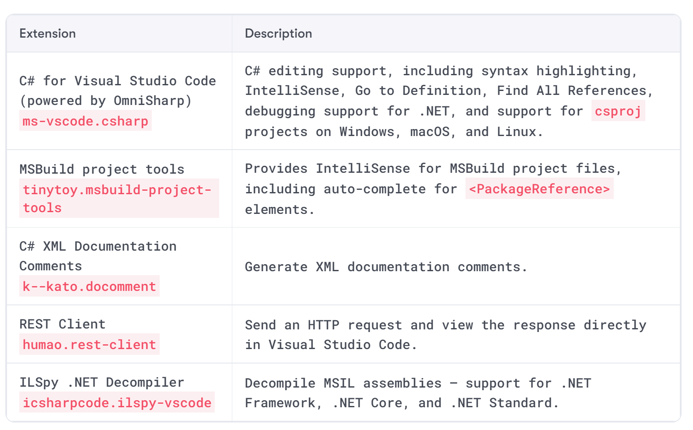

<https://marketplace.visualstudio.com/items?itemName=tintoy.msbuild-project-tools>
<https://marketplace.visualstudio.com/items?itemName=k--kato.docomment>
<https://marketplace.visualstudio.com/items?itemName=humao.rest-client>

닷넷버전, C#버전
dotnet --version
csc -langversion:?

dotnet --list-sdks
dotnet --list-runtimes

dotnet-core-uninstall
dotnet-core-uninstall --all-previews-but-latest --sdk

dotnet help new

<https://devblogs.microsoft.com/dotnet/>
<http://computerstufftheydidnteachyou.com/>

<https://dotnetfiddle.net/>

Visual Studio Code documentation: <https://code.visualstudio.com/docs>
.NET: <https://dotnet.microsoft.com>
.NET Core Command-Line Interface (CLI) tool: <https://aka.ms/dotnet-cli-docs>
.NET Core runtime, CoreCLR: <https://github.com/dotnet/runtime>
.NET Core Roadmap: <https://github.com/dotnet/core/blob/master/roadmap.md>
.NET Standard FAQ: <https://github.com/dotnet/standard/blob/master/docs/faq.md>
Stack Overflow: <https://stackoverflow.com/>
Google Advanced Search: <https://www.google.com/advanced_search>
Microsoft Learn: <https://docs.microsoft.com/en-us/learn/>
.NET Videos: <https://dotnet.microsoft.com/learn/videos>
Microsoft Channel 9 – .NET Videos: <https://channel9.msdn.com/Search?term=.net&lang-en=true>

More Information: You can learn more about the current status of the C# language at this link:
<https://github.com/dotnet/roslyn/blob/master/docs/Language%20Feature%20Status.md>

카멜 표기
타이틀 표기
Camel case : Local variables, private fields.
cost, orderDetail, dateOfBirth

Title case : Types, non-private fields, and other members like methods.
String, Int32, Cost, DateOfBirth, Run

Good Practice: Following a consistent set of naming conventions will enable your code to be easily understood by other developers (and yourself in the future!).
You can read more about naming guidelines at the following link: <https://docs.microsoft.com/en-us/dotnet/standard/design-guidelines/naming-guidelines>

이스케이프 시퀀스
<https://docs.microsoft.com/en-us/archive/blogs/csharpfaq/what-character-escape-sequences-are-available>
> \' - single quote, needed for character literals
> \" - double quote, needed for string literals
> \\ - backslash
> \0 - Unicode character 0
> \a - Alert (character 7)
> \b - Backspace (character 8)
> \f - Form feed (character 12)
> \n - New line (character 10)
> \r - Carriage return (character 13)
> \t - Horizontal tab (character 9)
> \v - Vertical quote (character 11)
> \uxxxx - Unicode escape sequence for character with hex value xxxx
> \xn[n][n][n] - Unicode escape sequence for character with hex value nnnn (variable length version of \uxxxx)
> \Uxxxxxxxx - Unicode escape sequence for character with hex value xxxxxxxx (for generating surrogates)

C# 버전 특징
<https://github.com/dotnet/roslyn/blob/main/docs/Language%20Feature%20Status.md>

dynamic vs object
dynamic은 C#4에서 추가됨

- 암호화 복호화 Encryption and decryption : These are a two-way process to convert your data from clear text into crypto-text and back again.
- 해쉬 Hashes: This is a one-way process to generate a hash value to securely store passwords, or can be used to detect malicious changes or corruption of your data.
- 서명 Signatures: This technique is used to ensure that data has come from someone you trust by validating a signature that has been applied to some data against someone's public key.
- 인증 Authentication: This technique is used to identify someone by checking their credentials.
- 허가 Authorization: This technique is used to ensure that someone has permission to perform an action or work with some data by checking the roles or groups they belong to.

IVs and block sizes : initialization vector (IV).
Salts : A salt is a random byte array that is used as an additional input to a one-way hash function. 

- AES
- DESCryptoServiceProvider
- TripleDESCryptoServiceProvider
- RC2CryptoServiceProvider
- RijndaelManaged